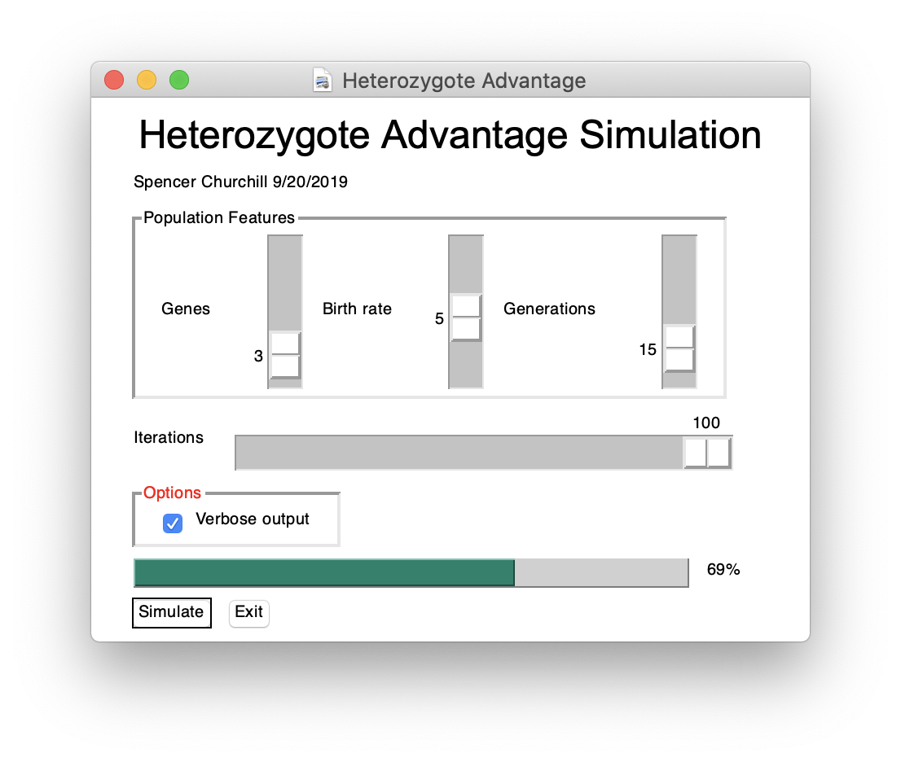
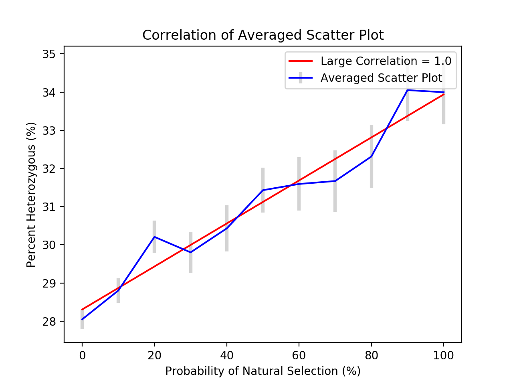

# Heterozygote Advantage Simulation
Simulations of populations with varying levels of natural selection to observe responses to heterozygous percentages.

## Hypothesis
The rate of natural selection is directly proportional to the frequency of heterozygous genes.

## Installation
```bash
pip install numpy scipy matplotlib pysimplegui
```

## Usage


Run
```bash
python hetadv.py
```

Simply set:
  number of genes,
  birth rate,
  generations,
  and iterations

But keep in mind this program is slows exponentially for more generations (especially above 20).

## Results


Here we can see a strong correlation between increasing natural selection and frequency heterozygous genes.
